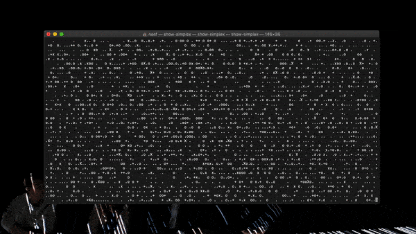

# show-simplex-rs

A CLI that displays an animated ASCII [simplex noise](https://en.wikipedia.org/wiki/Simplex_noise) field in your terminal. This repo is a Rust re-implementation of [my Node show-simplex package](https://github.com/neefrehman/show-simplex-cli/).

## npx execution

Run the below commands in your terminal to install and execute `show-simplex`.

```shell
cargo install show-simplex
```

```shell
show-simplex
```



## Alternate visualisations

`show-simplex` also has two alternative visualisations of the simplex noise field: `block` and `number`. To see them, use the appropriate command flags below.

```shell
show-simplex -a     # or --angle
```

```shell
show-simplex -n     # or --number
```

## License

This package is [MIT Licensed](https://github.com/neefrehman/show-simplex/blob/master/LICENSE).
